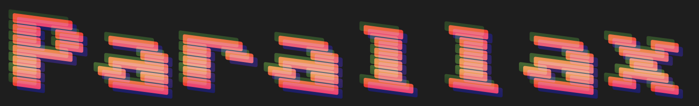

# Parallax

**Parallax** is a colour variable font for digital nostalgics. It is intended as a demonstration of COLRv1 variations: linear gradients, translations, skews, and separable blending.

It's also a demonstration of how to build complex colour effects into your fonts without a lot of work. The source is a single master Glyphs file, and all the variable font and colour effect magic is added to the font after it is built. Take a look at the [build process](build-parallax.py) and the [paint definition](paints.py) to understand how it is done.

I can't draw, I just do font technology, and so the glyphs of Parallax are derived from Jens Kutilek's [https://github.com/jenskutilek/homecomputer-fonts](SixtyFour) under the Open Font License. This font is OFL licensed accordingly.
